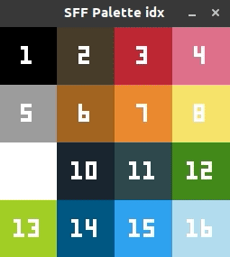

# paletteIdx
Get color number of color palette.  

Use that number to reference the color in __sff-love__.  
You can add new palettes to _palettes.lua_ file.  
Use arrows to switch palettes.  
Needs Löve 0.10.0 to run.  

